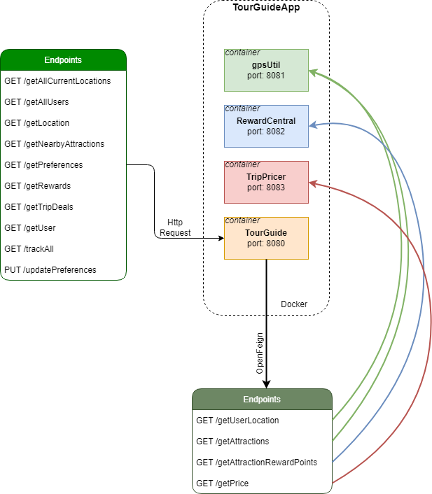

# TOUR GUIDE
```Author: Geoffrey Aulombard - Java web-application developer student at OpenClassRooms```

## Description

OpenClassRoom project number 8.
> This app use 4 microservice to help clients planning their trips depending on their location and attractions nearby. Clients earn points, and get trip deals depending on how many points the client has.

## Getting started

This is a multi-services app that run on ports ``8080``, ``8081``, ``8082`` and ``8083``.

## How it works
### Technologies

This is a Spring Boot Application, working with (check the ``build.gradle`` file to see all dependencies and versions)

- Springboot 2.5.6
- Java 11.0.11
- Gradle 6.9.1
- Docker version 18.09.0, build 4d60db4

### Architecture, Technical conception




### Run the app

first, create a new directory.

```bash
cd /path/to/directory/yourProjectName
```

clone the project using :

```bash
git clone https://github.com/GAulombard/OC_P8_TourGuide.git
```

use the following command to run the app:

 ```bash
 gradle clean bootJar
```
 ```bash
 docker-compose up -d --build 
```

stop the app using :
 ```bash
 docker-compose down
```


### Run the tests

use the following command to run tests:

 ```bash
 gradle test
```

## API
### Documentation

[TourGuideApp api - Swagger](http://localhost:8080/swagger-ui.html#/)

[GpsUtil api - Swagger](http://localhost:8081/swagger-ui.html#/)

[RewardCentral api - Swagger](http://localhost:8082/swagger-ui.html#/)

[TripPricer api - Swagger](http://localhost:8083/swagger-ui.html#/)

## Contributing

Pull requests are welcome. For major changes, please open an issue first to discuss what you would like to change.

Please make sure to update tests as appropriate.

## License

